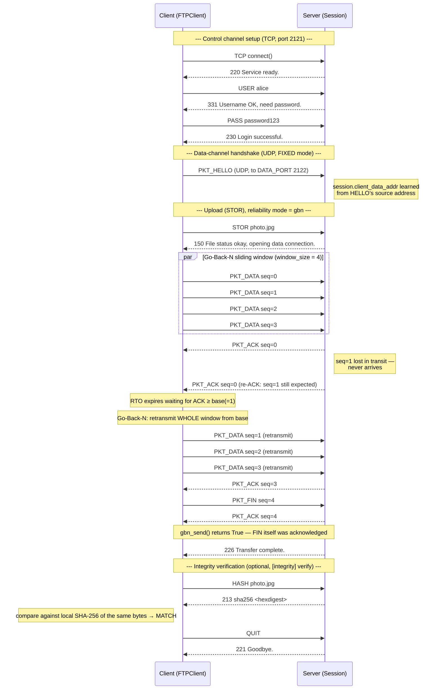
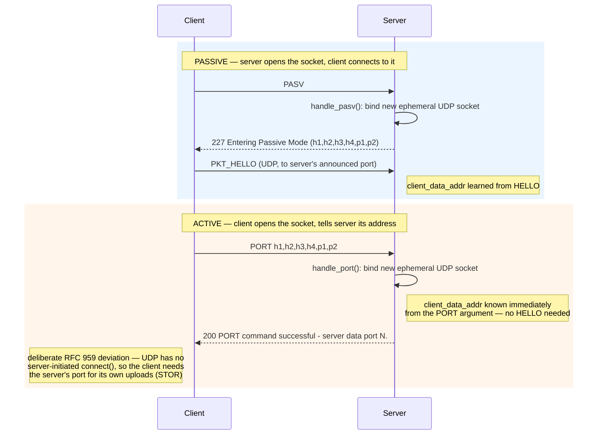
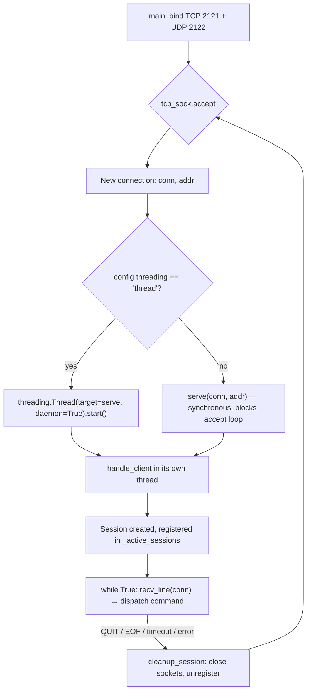
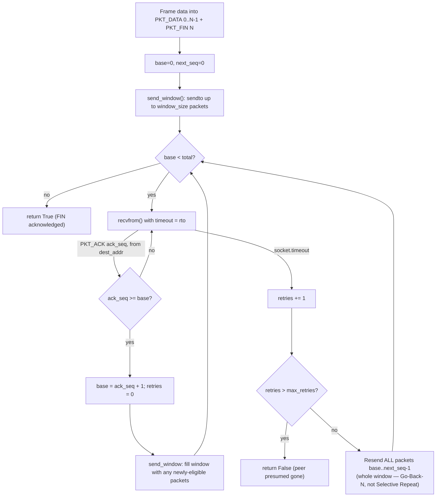
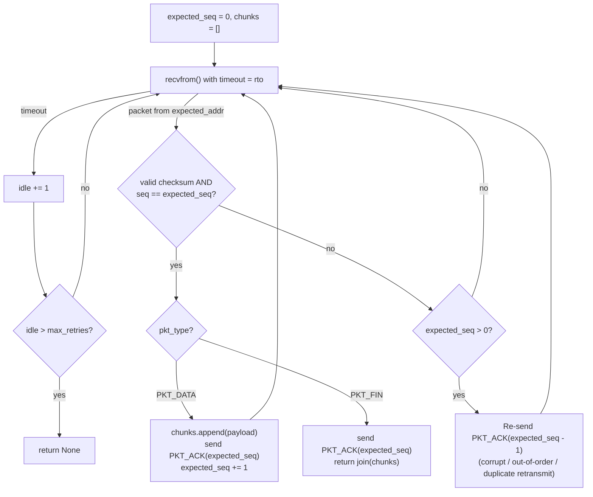
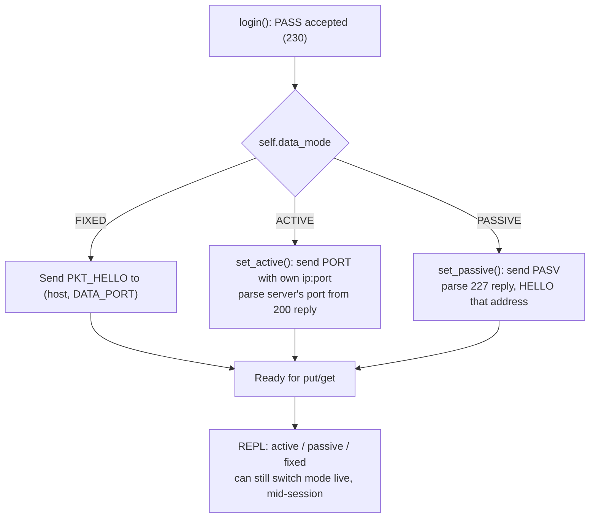

# Hybrid FTP — Diagrams

Source diagrams for the Technical Report (`docs/technical_report.tex`), Sections 1 and 3.
Rendered natively if viewed on GitHub/GitLab; export to PNG/SVG for LaTeX embedding via
`docs/render_diagrams.sh` (uses `@mermaid-js/mermaid-cli`).

## 1. Sequence diagrams (Report Section 1)

### 1.1 Full lifecycle — login, FIXED-mode STOR with a Go-Back-N retransmission

Covers: TCP control-channel handshake, the FIXED-mode `HELLO` address-learning
mechanism, and one simulated packet loss recovered by the Go-Back-N reliable-UDP
layer (`[reliability] mode = gbn`) — the sender retransmits its whole in-flight
window after a timeout, exactly as implemented in `common.gbn_send()`.



### 1.2 Active/Passive mode negotiation (Advanced Level)



## 2. Flowcharts (Report Section 3)

### 2.1 Server thread-dispatch logic (`server.py: main()`)



### 2.2 Go-Back-N sender state machine (`common.gbn_send()`)



### 2.3 Go-Back-N receiver state machine (`common.gbn_receive()`)



### 2.4 Client data-mode selection (`FTPClient.login()`)



## 3. Regenerating exported images

```bash
docs/render_diagrams.sh   # writes docs/diagrams/*.png for LaTeX \includegraphics
```
